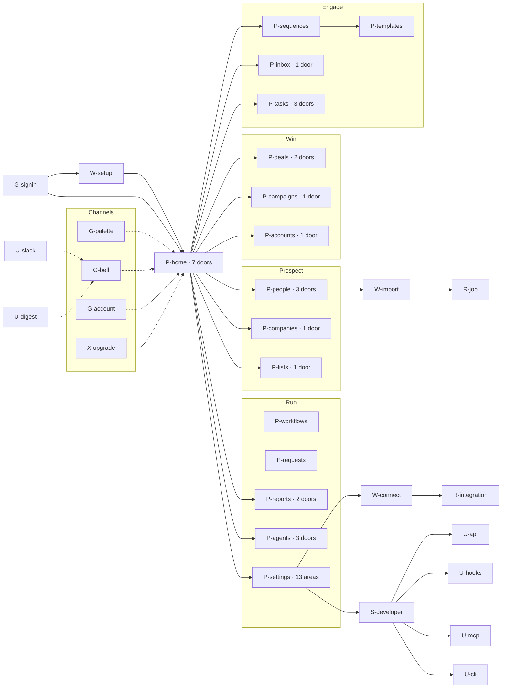
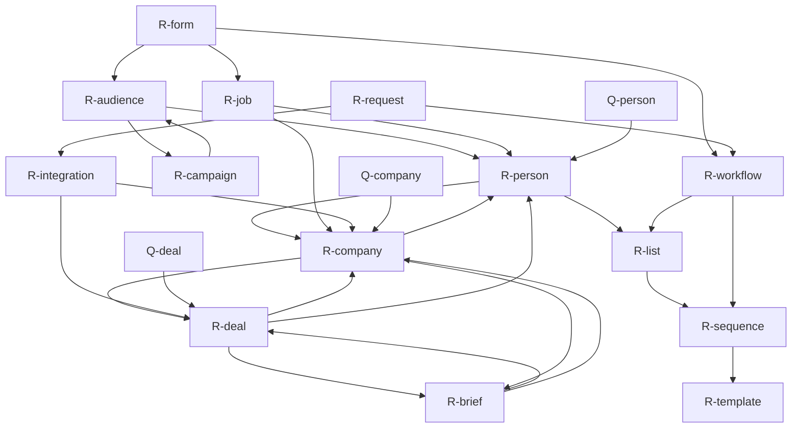

# Ollopa: the information architecture map

*Written 15 September 2026, after the boundary was widened and the 31 objects and 54 journeys were approved. This is the structure of the product before any screen is designed: every place a person meets Ollopa, every node inside it, every route between nodes, the level of each, and the 54 journeys walked across it.*

**What this file supersedes.** The fourteen-page table in [PRODUCT.md](PRODUCT.md) and the page list implied by the specs in [specs/](specs/). Those specs remain correct about door labels, containers, level-one decisions and copy; they are wrong about *how many nodes there are*, because they were written before the boundary widened on 15 September. Where a spec and this map disagree about the existence or the parent of a node, the map wins and the spec is amended in journey order.

**What it does not do.** It does not decide what is on a screen. Level one *inside* a node stays the usage model's job, item by item. The map decides what the nodes are, what reaches what, and how deep any route runs.

**Three conventions, stated once.**

1. **Navigation is not a door.** Moving from a page to another page — a row click, a section link, a breadcrumb, ⌘K — costs no disclosure level. A door is a disclosure: an in-place expansion, a drawer, a panel, a menu. The level counter therefore resets at every page. This is rule 2 read as it is written — "the screen, and one door" — and it is why RULES.md says to count *per channel*.
2. **Level 1 / level 2.** A level-1 node is a destination: reachable from the sidebar, from a Home section, from a row, from a link, from ⌘K or from a deep link, for a seat that holds it. A level-2 node is a disclosure hanging off a level-1 node: a door, a drawer, a quick look, a panel, a menu. **No level-2 node contains another level-2 node.** That is the whole of the level check in part 4.
3. **Seats, not roles.** Ollopa has five seats — SDR, AE, MK (marketer), CS, OPS (RevOps admin) — and the map adds none. The **sales leader** of L1–L3 is an AE seat that has direct reports, so the leader's extra nodes are AE nodes conditioned on `reports > 0`. The **developer** of D1–D4 is the OPS seat; 19's six live postings title the role RevOps or GTM engineer, and giving it a sixth seat would give Ollopa a seat no business in PRODUCT.md declares. Seat abbreviations below: SDR, AE, MK, CS, OPS, and `AE+` for an AE with reports.
4. **Profiles.** FO = Founder-led outbound (Fathom Labs, Starter). SEP = Separated sales team (Meridian Software, Scale). AG = Agency (Halyard, Growth). PLG = Product-led growth (Ridgeline, Growth). The profile column says whether a node's *entry point* is in the sidebar by default. A profile never removes a node; a left-out page opens and offers "Add to sidebar".

---

## 1. Surfaces

A surface is a place a person meets Ollopa. Nine of them. Four have no screen we control, and those four are where the approval batch, the consequence line, the credit cap and the three explanations of "cannot see it" have to be re-expressed rather than drawn.

**The app, signed in.** The shell carries five things on every page and no page redraws them: the sidebar built from seat plus profile, the page title, the **credits pill** with balance and weekly burn in text, the **bell**, and the account menu. The pill is the workspace's running meter and it is decision-critical, so it never collapses to an icon and it links to the credit breakdown by feature, person and surface. Every plan-gated control on every page opens the same upgrade panel with one total for the period. Every "cannot see it" resolves to exactly one of three answers — an object you do not own reads normally with the edit controls absent and one line naming the owner; an area your seat does not hold shows the no-access page naming the seats that use it and the admin to ask; a page the profile left out opens normally and offers "Add to sidebar" in its header. There is no fourth answer and no greyed control. Agent approvals arrive here as batches at a task boundary: a row on Home, a queue on Agents, never a modal mid-task.

**Sign-in and workspace set-up.** Sign-in picks the business and the person and carries no gating. Workspace set-up runs once, before the sidebar exists: three questions about the job to be done — what are you here to do first, how many people, which of these jobs exist here — and a result block naming the profile, previewing the sidebar and listing what it leaves out. Price sits at question two, as one total for the period, because seats are the workspace's first commitment. This surface carries the whole declared-sidebar promise in plain words: a left-out page still opens, its header offers "Add to sidebar", and a strong signal shows it for two weeks and then asks once. It is the only surface where the product asks instead of reading a seat.

**Notifications: the bell.** A panel, never a page, with four time sections and no expansion inside it: a grouped row navigates to its page filtered rather than growing a third level. It is a channel of its own, so it never counts against a page's one door, and it carries three interrupting kinds only — bounce guard tripped, sync error, credits low. Agent approvals appear in the bell as a *count with a task-boundary sentence* ("6 arrived while the outreach agent ran, 09:02 — 4 emails, 2 enrolments, 8 credits"), and the row opens the queue; the bell never holds an Approve button, because approving without the consequence line in front of you is exactly the 76% pass-through rule 7's corollary warns about.

**Notifications: Slack.** A Slack message is a deep link with a summary, not a control. Five event kinds, set at connection time: reply received, meeting booked, deal moved, agent needs approval, sync error. An agent-approval message carries the four things the queue row carries — actor, consequence sentence, credit cost, and whether a second admin approval is needed — and then a link, because a person who approves from a notification has read a notification, not a decision.

**Notifications: the email digest.** Daily, on by default, per person. A digest of what waits, not a queue: overdue tasks, unhandled replies, the agent batch total with its credit cost, any paused sequence with its observed rate beside the threshold pair, and the credit run-out date when it falls inside the billing period. The cap and the burn are in the body, not behind the link: an email that says "review 6 items" and hides the 8 credits is a deferred fee. Every line deep-links to a node in this map.

**Deep links from outside.** A bookmark, a Slack link, a CRM record, a calendar invite, a ticket. The deep link is a first-class route, not a fallback: a large share of B2B navigation never touches the menu. Every level-1 node has a stable URL, every level-2 node worth landing on has an anchor or query parameter that opens it — a settings item, a record door, a report with its filters, a specific agent item — and landing deep never skips a level, because the parent renders with the child open. A deep link into an area the seat does not hold lands on the no-access page; a deep link into a page the profile left out opens the page with "Add to sidebar" in the header.

**⌘K.** A command palette is a channel of its own: a button, then results, two deep, never more. It reaches every level-1 node in the product for the seat that holds it, not only the ones in the sidebar, which is what makes the declared sidebar safe to subtract from. It carries three staged commands that look like a second level and are not — "Add {name} to sequence…", "Add {name} to list…", "Approve all pending agent actions" — each of which refines the same dialog rather than opening a new one. Every shortcut is printed beside its command, and the palette's inline hint is treated as the floor of teaching, never the mechanism.

**The API.** Keys are created and scoped in Settings, stored outside the app, and every key's spend is attributed to it and shown against the workspace balance. Limits are published per team, not per key, so minting keys is not a workaround. Reads are free; enrichment costs, and the tail is published, because one waterfall phone lookup can reach 45 credits. Here "decision-critical is never behind a door" becomes a header and a document: remaining requests in a response header, the per-key allocation readable at any time, an 80% alert to the key's owner. A write that crosses the second-approval threshold does not silently succeed and does not silently fail — it returns a pending approval object with the consequence line, the credit cost and the approver's name, and the same item appears in the app's queue. API is a Growth-plan entitlement; on Starter the key row is visible, locked, with the plan name.

**Webhooks.** Outbound only, with a written contract the product states rather than the customer discovers: at-least-once, signed, attempt-numbered, retried for 24 hours, never silently disabled, plus a reconciliation endpoint so the nightly sweep is cheap. The subscription's own state is visible, not only the receiver's uptime. Approvals do not travel by webhook — a webhook fires on what *happened*, never on what needs deciding — because a surface with no reply path cannot carry a decision. The delivery log lives in the subscription drawer with the failure grouped by cause, the same way sync errors are grouped.

**MCP, three scopes.** A per-user remote endpoint, authorised as the person, carrying their permissions, their credit limit and the workspace's compliance restrictions. Three scope tiers — **read**, **safe writes**, **destructive writes** — and inside the chosen tier each action is allowed, approval-required or blocked. This is the hardest case for the approval rule, because there is no screen: the approval batch has to arrive **in the client**, as a card the model cannot summarise away, carrying the actor, the consequence sentence, the recipients or the record, the credit cost, and the second-approval line when it applies. The same item lands in the app's queue and the same run lands in the ledger with the surface marked "MCP" and the user named. The three kinds of "cannot see it" arrive as text with the same three shapes: an object you do not own returns its readable fields and a line naming the owner; an area your seat does not hold returns a refusal naming the seats that hold it and the admin to ask; a page the profile left out is not a concept here at all, because MCP has no sidebar. **Read scope is on every plan**; safe and destructive writes ride the API entitlement at Growth and above, and the lock is stated by the endpoint at connection time, not at the moment a write fails.

**The CLI.** Narrow on purpose: authenticate (browser, or device flow where there is no browser), search, export, bulk update with a resume variant on every bulk operation, allocation check, analytics. It is the agency's surface — ten workspaces, one loop — so every command takes a workspace and the workspace name is echoed in every confirmation. Before a bulk write the CLI prints the same three facts the app prints: what will change, how many records, how many credits, and it checks the allocation before the run rather than failing halfway. Above the threshold it blocks and prints the approval line with the admin's name, and the resume token means the run continues rather than restarts once the approval lands. A locked capability prints the plan name and the monthly total, not a 403.

---

## 2. The node inventory

Derived from the 31 objects and the 54 journeys, not from the old fourteen-page table. Nothing the journeys need was removed. What the widened boundary needs was added: call logging, the meeting object, forms, signals and scoring, API keys and webhooks, the MCP and CLI surfaces, the admin's intake request queue, notes and briefs, workflows, templates and enrichment jobs.

Column notes. **Type** is one of page, record, quick look, wizard, panel, settings area, door, surface. *Surface* is the eighth type, added because MCP, the CLI, the API, webhooks, Slack and the digest are places a person meets the product that have no page in the app; they carry nodes but are not reached from the sidebar. **Sidebar** says which of the four workspace profiles put the node's entry point in the sidebar by default; `—` means the node is not a sidebar entry at all and is reached by link, row, ⌘K or deep link. **Gate** is the plan on which the node or its key control unlocks; `—` means every plan.

### 2.1 Shell and entry

| id | name | type | objects | parent | lvl | seats | sidebar | gate | journeys |
|---|---|---|---|---|---|---|---|---|---|
| `G-signin` | Sign in | page | workspace, user | — | 1 | all | — | — | all (entry) |
| `W-setup` | Workspace set-up | wizard | workspace, seat, profile, plan | `G-signin` | 1 | OPS | — | — | O1 |
| `G-palette` | ⌘K palette | panel | every named object | every page | 2 | all | all | — | S3, S7, O1, O9, D4 |
| `G-bell` | Notification panel | panel | task, thread, agent item, integration, credit | every page | 2 | all | all | — | S1, S11, S13, O4, O6, C3, C5 |
| `G-account` | Account menu | panel | user, workspace | every page | 2 | all | all | — | O1, O2, D4 |
| `G-shortcuts` | Keyboard shortcut sheet | panel | — | `G-account` | 2 | all | all | — | (accelerator; see gaps) |
| `G-noaccess` | Not part of your seat | page | user, profile | URL only | 1 | all | — | — | O5 |
| `X-upgrade` | Upgrade panel | panel | plan, workspace, request | any gated control | 2 | all | — | n/a | O10, O5, M6, D1, D3 |
| `X-credits` | Credit breakdown by feature, person and surface | panel | credit, user, key, agent | credits pill, `S-plan` | 2 | all | all | — | O6, S4, D1, D3 |
| `X-viewas` | View as | panel | user, profile, seat | `S-team` | 2 | OPS | — | Growth | O2, O5 |

### 2.2 Home

Home is the only node whose sections are chosen by seat rather than by object. Every section has a link to its page; links are navigation and cost no level.

| id | name | type | objects | parent | lvl | seats | sidebar | gate | journeys |
|---|---|---|---|---|---|---|---|---|---|
| `P-home` | Home | page | task, thread, deal, agent item, credit, integration, signal | sidebar | 1 | all | all | — | S1, S13, A1, C3, C5, O1, O3, G1 |
| `D-home-later` | Tomorrow and later (n) | door | task | `P-home` | 2 | SDR, AE, CS, OPS | all | — | S1 |
| `D-home-replies` | Not now and out-of-office replies (n) | door | thread | `P-home` | 2 | SDR, AE | all | — | S1, S11 |
| `D-home-pipeline` | By stage and forecast category | door | deal | `P-home` | 2 | AE, CS, OPS | all | — | A1, A5 |
| `D-home-agents` | What agents did this week (n) | door | agent run | `P-home` | 2 | all | all | — | S1, G1 |
| `D-home-item` | What the agent found | door | agent run, person, company | `P-home` | 2 | all | all | — | S1, G2, G4, G5 |
| `D-home-audiences` | Audiences that changed (n) | door | audience | `P-home` | 2 | MK, OPS | SEP, PLG | — | M1, M6 |
| `D-home-setup` | Setup steps remaining | door | integration, mailbox, user | `P-home` | 2 | OPS | all | — | O1, O3 |

### 2.3 People

| id | name | type | objects | parent | lvl | seats | sidebar | gate | journeys |
|---|---|---|---|---|---|---|---|---|---|
| `P-people` | People | page | person, list, sequence, score, signal, credit | sidebar | 1 | SDR, AE, MK, OPS | all | — | S3, S4, S6, M3, M4, O8, D1 |
| `Q-person` | Contact quick look | quick look | person | `P-people` | 2 | SDR, AE, MK, OPS | — | — | S3, S4, S11, M4 |
| `R-person` | Contact record | record | person, company, thread, task, call, meeting, note, score | `P-people` row / any link | 1 | SDR, AE, MK, CS, OPS | — | — | S2, S6, S9, S11, S12, A3, C5, G3 |
| `D-people-filters` | All filters (31) | door | person, persona, signal, score, list | `P-people` | 2 | SDR, AE, MK, OPS | — | — | S3, S6, M3, M4, O8 |
| `D-people-views` | All views (12) | door | person (saved view) | `P-people` | 2 | SDR, AE, MK, OPS | — | — | S3 |
| `D-people-columns` | Columns and density | door | person, field | `P-people` | 2 | SDR, AE, MK, OPS | — | — | O4 |
| `X-findpeople` | Find people | panel | person, persona, company, credit | `P-people`, `R-company` | 2 | SDR, AE, OPS | — | — | S2, S3 |
| `X-enrich` | Reveal and enrich, with the credit estimate | panel | person, company, enrichment job, credit | `P-people`, `P-companies`, `R-list` | 2 | SDR, AE, MK, OPS | — | — | S4, S5, S6, M5, O4, D1 |
| `D-person-activity` | All activity · n | door | thread, call, meeting, task | `R-person` | 2 | all | — | — | S11, A3 |
| `D-person-enrich` | Enrichment data and sources | door | enrichment job, credit | `R-person` | 2 | SDR, AE, OPS | — | — | S6, O4 |
| `D-person-history` | Full history, custom fields and files | door | field, note | `R-person` | 2 | all | — | — | S6, A3 |
| `X-note` | Write a note | panel | note, person, company, deal | any record | 2 | all | — | — | S2, S9, A4, C3, C5 |

### 2.4 Companies and accounts

Company and account are one object with a customer state, so there is one record and two entry tables. Accounts is not a second record; it is the customer-state view with its own columns, its own level-one field set and its own row actions.

| id | name | type | objects | parent | lvl | seats | sidebar | gate | journeys |
|---|---|---|---|---|---|---|---|---|---|
| `P-companies` | Companies | page | company, person, signal, score, list | sidebar | 1 | SDR, AE, CS, OPS | all | — | S3, S6, M1, O4, O8 |
| `Q-company` | Company quick look | quick look | company | `P-companies` | 2 | SDR, AE, CS, OPS | — | — | S3, S6, M1 |
| `R-company` | Company record (account when a customer) | record | company, person, deal, signal, score, note, brief, file, health | row / any link | 1 | all | — | — | S2, S6, S12, A7, C1–C5, G1 |
| `D-co-filters` | Additional filters: owner, location, activity, signals, lists, fields | door | company, signal, score, territory | `P-companies` | 2 | SDR, AE, CS, OPS | — | — | S3, M1, O8 |
| `X-findcos` | Find companies | panel | company, persona, signal, credit | `P-companies` | 2 | SDR, AE, OPS | — | — | S3 |
| `D-co-research` | Agent research · n runs, n credits a run | door | agent run, brief, credit | `R-company` | 2 | all | — | — | S2, G1 |
| `D-co-signals` | Signals and news · n | door | signal, score | `R-company`, `P-accounts` row | 2 | all | — | — | S2, S6, C3, C5 |
| `D-co-crm` | CRM sync · synced hh:mm | door | integration, field | `R-company` | 2 | AE, CS, OPS | — | — | O3, O4 |
| `D-co-hierarchy` | Parent and subsidiaries | door | company | `R-company` | 2 | AE, CS, OPS | — | — | S3, C4 |
| `P-accounts` | Accounts | page | company, score, deal (renewal), signal, task | sidebar | 1 | AE, CS, OPS | SEP, PLG | — | C3, C4, C5, C6, A7 |
| `D-acct-health` | How this health score was built | door | score, signal | `P-accounts`, `R-company` | 2 | AE, CS, OPS | — | — | C3, C4, C6, G3 |
| `X-play` | Run a risk or expansion play | panel | task, note, person, signal | `P-accounts`, `R-company` | 2 | CS, AE, OPS | — | — | C3, C5 |

### 2.5 Lists and segments

| id | name | type | objects | parent | lvl | seats | sidebar | gate | journeys |
|---|---|---|---|---|---|---|---|---|---|
| `P-lists` | Lists | page | list, segment, person, company | sidebar | 1 | SDR, MK, OPS | FO, SEP, AG | — | S3, S5, M1, O8 |
| `R-list` | List or segment | record | list, person, company, sequence, credit | `P-lists` row | 1 | SDR, MK, OPS | — | — | S3, S4, S5, S8, M1 |
| `D-lists-filters` | Mode, source, archived | door | list | `P-lists` | 2 | SDR, MK, OPS | — | — | S3 |
| `D-list-refresh` | Refresh and alerts | door | list, signal, workflow | `R-list` | 2 | SDR, MK, OPS | — | — | S3, M1 |
| `D-list-history` | History: n changes | door | list | `R-list` | 2 | SDR, MK, OPS | — | — | M1 |
| `X-listadd` | Add people to this list | panel | person, company, credit | `R-list` | 2 | SDR, MK, OPS | — | — | S3, S5, M1 |

### 2.6 Sequences, steps and templates

| id | name | type | objects | parent | lvl | seats | sidebar | gate | journeys |
|---|---|---|---|---|---|---|---|---|---|
| `P-sequences` | Sequences | page | sequence, mailbox, report | sidebar | 1 | SDR, AE, OPS | FO, SEP, AG | — | S7, S8, S13, O7 |
| `R-sequence` | Sequence | record | sequence, step, person, mailbox, template, report | `P-sequences` row | 1 | SDR, AE, OPS | — | — | S7, S8, S13, G4 |
| `D-seq-step` | Step n: copy, wait, variants | door | step, template, snippet, task | `R-sequence` | 2 | SDR, AE, OPS | — | — | S7, S10, G2 |
| `D-seq-send` | Change sending settings | door | mailbox, schedule, ruleset, bounce guard | `R-sequence` | 2 | SDR, AE, OPS | — | — | S8, S13, O7 |
| `D-seq-results` | Results by step | door | report, step, person | `R-sequence` | 2 | SDR, AE, OPS | — | — | S7, S13 |
| `X-enrol` | Enrol in a sequence | panel | sequence, person, list, mailbox, credit | `P-people`, `R-list`, `R-sequence`, `Q-person`, `X-thread` | 2 | SDR, AE, OPS | — | — | S3, S6, S8, S11, G4 |
| `X-preview` | Preview on a real contact | panel | step, template, person, field | `D-seq-step` → own channel | 2 | SDR, AE, OPS | — | — | S7 |
| `P-templates` | Templates and snippets | page | template, snippet, field | link, ⌘K | 1 | SDR, AE, MK, OPS | — | — | S7, S10, M2 |
| `R-template` | Template or snippet | record | template, snippet, step | `P-templates` row | 1 | SDR, AE, MK, OPS | — | — | S7, M2 |

### 2.7 Inbox, meetings, briefs

| id | name | type | objects | parent | lvl | seats | sidebar | gate | journeys |
|---|---|---|---|---|---|---|---|---|---|
| `P-inbox` | Inbox | page | thread, person, sequence, task | sidebar | 1 | SDR, AE | SEP, AG, PLG | — | S11, S12, O1 |
| `X-thread` | The thread | panel | thread, person, sequence, meeting | `P-inbox` | 2 | SDR, AE | — | — | S11, S12, A2 |
| `D-inbox-filters` | Outcome, sequence, owner, date | door | thread | `P-inbox` | 2 | SDR, AE | — | — | S11 |
| `X-reply` | Reply, with the agent draft beside it | panel | email, thread, agent run, template | `X-thread`, `R-person` | 2 | SDR, AE | — | — | S11, A2, G2 |
| `X-book` | Book a meeting | panel | meeting, person, task, sequence | `X-thread`, `P-tasks`, `R-deal`, `R-company` | 2 | SDR, AE, CS | — | — | S12, C1, C2, C4 |
| `X-meeting` | The meeting: attendees, status, prep, follow-up | panel | meeting, person, note, brief, task, email | `P-tasks`, `R-deal`, `R-company`, `X-thread` | 2 | SDR, AE, CS | — | — | S12, A2, C1, C2, C4, L3 |
| `R-brief` | Brief | record | note, brief, company, deal, person, meeting | `R-deal`, `R-company`, `X-meeting`, `P-home` | 1 | all | — | — | S2, S12, A2, A7, C1, C4, C5, G1 |

### 2.8 Tasks, calls and LinkedIn

A call is not a task. The task is the instruction; the call is the outcome, and the disposition decides whether the contact advances. So the call log is its own node, reachable from the task row, from the queue console and from any record's activity.

| id | name | type | objects | parent | lvl | seats | sidebar | gate | journeys |
|---|---|---|---|---|---|---|---|---|---|
| `P-tasks` | Tasks | page | task, person, company, deal, sequence | sidebar | 1 | SDR, AE, CS, OPS | all | — | S1, S9, S10, A1, C2, C5, M4 |
| `D-task-row` | History and contact | door | task, person, note, call | `P-tasks` | 2 | SDR, AE, CS, OPS | — | — | S9, S10 |
| `D-task-filters` | More filters: source, status, sort | door | task, sequence, user | `P-tasks` | 2 | SDR, AE, CS, OPS | — | — | S9, M4 |
| `D-task-options` | Table options: columns, export | door | task, field | `P-tasks` | 2 | SDR, AE, CS, OPS | — | — | D4 |
| `X-queue` | Work the queue | panel | task, call, person, note, sequence | `P-tasks` | 2 | SDR, AE | — | — | S9, S10 |
| `X-calllog` | Log the call: purpose, disposition, duration, notes | panel | call, person, task, sequence, note | `P-tasks`, `X-queue`, `R-person`, `R-deal` | 2 | SDR, AE, CS | — | — | S9, A2, L3 |
| `X-linkedin` | LinkedIn step: the message, copy, mark complete | panel | task, step, snippet, person | `P-tasks`, `X-queue` | 2 | SDR, AE | — | — | S10 |
| `X-task` | New task: contact, type, due, title, note, owner | panel | task, person, company, deal, user | `P-tasks`, any record | 2 | SDR, AE, CS, OPS | — | — | S2, S12, A2, A6, C2, C5, O9 |

### 2.9 Deals

| id | name | type | objects | parent | lvl | seats | sidebar | gate | journeys |
|---|---|---|---|---|---|---|---|---|---|
| `P-deals` | Deals | page | deal, company, person, task, report | sidebar | 1 | AE, CS, OPS | SEP, PLG | — | A1, A4, A5, A6, C6, L1 |
| `Q-deal` | Deal quick look (stage editable) | quick look | deal | `P-deals` | 2 | AE, CS, OPS | — | — | A1, A4, L1 |
| `R-deal` | Deal | record | deal, company, person and roles, task, meeting, note, field, brief | `P-deals` card / any link | 1 | AE, CS, OPS, SDR (read) | — | — | A1–A7, C4, C6, L1, L2, G5 |
| `D-deals-view` | View options: columns, density, saved views | door | deal, field | `P-deals` | 2 | AE, CS, OPS | — | — | A1, L1 |
| `D-deals-filters` | Warnings, owner, stage, close date, forecast category | door | deal, user, report | `P-deals` | 2 | AE, CS, OPS | — | — | A1, A4, A6, L1, C6 |
| `D-deal-evidence` | Evidence and source quotes · n | door | conversation input, field, agent run, note | `R-deal` | 2 | AE, OPS | — | — | A3, G5 |
| `D-deal-activity` | All activity · n | door | thread, call, meeting, task | `R-deal` | 2 | AE, CS, OPS | — | — | A2, A6, L1 |
| `D-deal-history` | Full history and custom fields | door | field, note, deal | `R-deal` | 2 | AE, CS, OPS | — | — | A5, G5 |
| `D-deal-files` | Files and the proposal · n | door | file, deal | `R-deal` | 2 | AE, CS | — | — | A7, C1 |

### 2.10 Campaigns, audiences and forms

Forms are a third view on Campaigns rather than a page of their own: a form is how an audience is built from inbound, and its credit cap is a campaign decision.

| id | name | type | objects | parent | lvl | seats | sidebar | gate | journeys |
|---|---|---|---|---|---|---|---|---|---|
| `P-campaigns` | Campaigns · Audiences · Forms | page | campaign, audience, form, report | sidebar | 1 | MK, OPS | SEP, PLG | — | M1, M2, M5, M6 |
| `R-campaign` | Campaign | record | campaign, audience, email, template, report, sequence | `P-campaigns` row | 1 | MK, OPS | — | — | M2, M5, M6 |
| `R-audience` | Audience or segment | record | audience, person, company, deal, persona | `P-campaigns` row | 1 | MK, OPS | — | — | M1, M2, M6 |
| `R-form` | Form | record | form, field, enrichment job, credit, campaign, workflow | `P-campaigns` row | 1 | MK, OPS | — | — | M5 |
| `D-camp-filters` | More filters: owner, audience, date, goal | door | campaign | `P-campaigns` | 2 | MK, OPS | — | — | M6 |
| `D-aud-suppress` | Suppressions: customers, open deals, closed-lost, in sequence | door | audience, company, deal, sequence | `R-audience` | 2 | MK, OPS | — | — | M1, M2 |
| `X-qa` | QA checklist, run by someone who did not build it | panel | campaign, audience, email, user | `R-campaign` | 2 | MK, OPS | — | — | M2 |
| `X-schedule` | Schedule and send | panel | campaign, audience, mailbox, credit, request | `R-campaign` | 2 | MK, OPS | — | — | M2, G4 |
| `X-sendtest` | Send a test | panel | campaign, email, mailbox | `R-campaign` | 2 | MK, OPS | — | — | M2 |
| `X-recipients` | Recipients · n | panel | person, campaign, thread | `R-campaign` | 2 | MK, OPS | — | — | M2, M6 |

### 2.11 Workflows and requests

Two nodes the old page table had nowhere to put. Routing rules were invisible, and the admin's intake queue was in Slack, where it cannot be counted.

| id | name | type | objects | parent | lvl | seats | sidebar | gate | journeys |
|---|---|---|---|---|---|---|---|---|---|
| `P-workflows` | Workflows | page | workflow, trigger, list, sequence, task, credit | sidebar | 1 | OPS, MK | SEP, PLG | Growth | M4, M5, O9 |
| `R-workflow` | Workflow | record | workflow, rule, action, credit, run | `P-workflows` row | 1 | OPS, MK | — | Growth | M4, M5, O9 |
| `D-wf-runs` | Run history and enrolment · n | door | workflow run, person, credit | `R-workflow` | 2 | OPS, MK | — | Growth | M4, O9 |
| `P-requests` | Requests | page | request, upgrade request, field, stage, profile, plan | sidebar | 1 | OPS | SEP, AG, PLG | — | O5, O9, O10 |
| `R-request` | Request | record | request, field, stage, workflow, profile, user | `P-requests` row | 1 | OPS | — | — | O9, O5 |

### 2.12 Reports

Five tabs, one page. Forecast is the fifth and it is where A5, L2 and C6 land; the renewal book is the Forecast tab filtered to renewal-typed deals, not a sixth report.

| id | name | type | objects | parent | lvl | seats | sidebar | gate | journeys |
|---|---|---|---|---|---|---|---|---|---|
| `P-reports` | Reports: Activity, Pipeline, Sequences, Campaign results, Forecast | page | report, goal, deal, campaign, sequence, user | sidebar | 1 | AE, MK, CS, OPS | SEP, AG, PLG | — | A5, A6, M3, M6, C6, O4, L1, L2, L3 |
| `X-report-records` | The records behind this number | panel | deal, person, campaign, sequence | `P-reports` | 2 | AE, MK, CS, OPS | — | — | M3, M6, L1 |
| `D-report-conv` | Stage-to-stage conversion and archived reasons | door | deal, report | `P-reports` | 2 | AE, OPS, MK | — | — | L1, M3 |
| `D-report-columns` | Columns: n of n | door | report, field | `P-reports` | 2 | AE, MK, CS, OPS | — | — | M6 |
| `X-forecast` | Submit your forecast | panel | deal, report, goal, note, user hierarchy | `P-reports` (Forecast tab) | 2 | AE, CS, OPS | — | — | A5, C6, L2 |
| `X-export` | Export: this table, the records, a link, a weekly email | panel | report, credit | `P-reports` | 2 | AE, MK, CS, OPS | — | Growth / Scale | M6, D4, O4 |

### 2.13 Agents

| id | name | type | objects | parent | lvl | seats | sidebar | gate | journeys |
|---|---|---|---|---|---|---|---|---|---|
| `P-agents` | Agents | page | agent, agent run, credit, person, deal, sequence | sidebar | 1 | SDR, AE, MK, OPS | all | 2 / 3 / all | S1, A1, G1–G5, O6 |
| `D-agent-item` | Read the draft · n words / Research · n sources / Score n · how it was built | door | agent run, email, person, score | `P-agents` | 2 | SDR, AE, MK, OPS | — | — | G2, G4, G5, S11 |
| `D-agent-steps` | Step log · n steps, n credits | door | agent run, credit | `P-agents` | 2 | SDR, AE, MK, OPS | — | — | G1, G3, O6 |
| `D-agent-filters` | Date, outcome, kind, teammate | door | agent run, user | `P-agents` | 2 | SDR, AE, MK, OPS | — | — | O6, G3 |
| `X-agent-batch` | Approve n · decline n, with the total consequence | panel | agent run, credit, mailbox, sequence | `P-agents`, `P-home` | 2 | SDR, AE, MK, OPS | — | — | S1, G2, G4 |
| `X-agent-edit` | Edit then approve | panel | agent run, email, deal, field | `D-agent-item` → own channel | 2 | SDR, AE, MK, OPS | — | — | G2, G5 |

### 2.14 Settings

One page, no settings shell, no settings sidebar. Each area is a node with at most one door. Three new areas: **Signals, scoring and personas** (the missing configuration behind agents that already score leads), **API, webhooks, MCP and CLI** (the developer surfaces), and **How your team works** (the declared sidebar), which the 14 September decision already added.

| id | name | type | objects | parent | lvl | seats | sidebar | gate | journeys |
|---|---|---|---|---|---|---|---|---|---|
| `P-settings` | Settings | page | workspace, plan, credit, and every configured object | sidebar | 1 | all | all | — | O1–O10, S13, D1–D4 |
| `S-you` | You | settings area | user, mailbox, credit, agent | `P-settings` | 1 | all | all | — | O1, O2, S13, O6 |
| `S-workspace` | Workspace | settings area | workspace | `P-settings` | 1 | OPS | all | — | O1, O7 |
| `S-howteam` | How your team works | settings area | workspace, profile, seat, user | `P-settings` | 1 | OPS | all | — | O1, O2, O5 |
| `S-team` | Team and access | settings area | user, team, profile, territory, seat, security | `P-settings` | 1 | OPS | all | Growth / Scale | O2, O5, O8 |
| `S-sending` | Email sending | settings area | mailbox, domain, bounce guard, tracking | `P-settings` | 1 | OPS, SDR | all | Growth | S13, O7, O2 |
| `S-prospecting` | Prospecting rules | settings area | person, region, DNC list, duplicate rule, territory | `P-settings` | 1 | OPS | all | Growth | O8, S5, O4 |
| `S-pipeline` | Pipeline and data | settings area | pipeline, stage, field, currency, enrichment order | `P-settings` | 1 | OPS | all | — | O3, O4, O9 |
| `S-sequences` | Sequences | settings area | schedule, ruleset, priority | `P-settings` | 1 | OPS, SDR | all | Growth | O7, S13 |
| `S-scoring` | Signals, scoring and personas | settings area | signal, score, persona, routing threshold | `P-settings` | 1 | OPS, MK | all | — | M3, M4, C3, C5, G3 |
| `S-agents` | Agents and AI | settings area | agent, credit cap, approval policy, model key, company context | `P-settings` | 1 | OPS | all | 2 / 3 / all | O6, O10, G1–G5 |
| `S-integrations` | Integrations | settings area | integration, field, error log | `P-settings` | 1 | OPS | all | Growth / Scale | O3, O4, O1 |
| `S-developer` | API, webhooks, MCP and CLI | settings area | key, webhook, token, credit, surface | `P-settings` | 1 | OPS | all | Growth (read MCP: all) | D1, D2, D3, D4, O6, O8 |
| `S-plan` | Plan, billing and usage | settings area | plan, seat, credit, invoice, workspace | `P-settings` | 1 | OPS | all | — | O6, O10, O2 |
| `X-mailbox` | Mailbox: warm-up, limits, signature, unlink | panel | mailbox, user, domain | `S-sending`, `S-you` | 2 | OPS, SDR, AE | — | Growth (2nd box) | S13, O2, O7 |
| `X-domain` | Sending domain: SPF, DKIM, DMARC, bounce rate | panel | domain, mailbox | `S-sending` | 2 | OPS | — | — | S13, O7 |
| `X-user` | User: seat, profile, team, territory, credit limit | panel | user, seat, profile, team, territory, credit | `S-team` | 2 | OPS | — | Growth | O2, O5, O6 |
| `X-field` | Field or stage: type, values, required-at-stage, CRM mapping | panel | field, stage, integration | `S-pipeline` | 2 | OPS | — | — | O9, O3, A3 |
| `X-territory` | Territory: filters and owners | panel | territory, user, company | `S-team`, `S-prospecting` | 2 | OPS | — | Growth | O5, M4 |
| `X-removal` | Removal list: review, export, delete everywhere | panel | person, list, enrichment job, integration, key, agent | `S-prospecting` | 2 | OPS | — | — | O8 |

### 2.15 Integrations, imports and jobs

| id | name | type | objects | parent | lvl | seats | sidebar | gate | journeys |
|---|---|---|---|---|---|---|---|---|---|
| `W-connect` | Connect an integration | wizard | integration, field, stage, credit | `S-integrations`, `D-home-setup` | 1 | OPS | — | Growth (webhook, API) | O3, O1, D2 |
| `R-integration` | Integration | record | integration, field, error log, credit | `S-integrations` row, `W-connect` end | 1 | OPS | — | — | O3, O4, D2 |
| `X-errors` | Sync errors grouped by cause · n | panel | error log, integration, person, company | `R-integration`, `P-home` health strip | 2 | OPS | — | — | O4 |
| `W-import` | Import and enrich | wizard | person, company, enrichment job, credit, field, integration | `P-people`, `P-companies`, `P-lists` page actions | 1 | SDR, MK, OPS | — | — | S5, O4 |
| `R-job` | Enrichment job | record | enrichment job, credit, person, company, report | `W-import` end, `S-prospecting`, `X-credits` | 1 | SDR, MK, OPS | — | — | S5, O4, O6, D1, M5 |

### 2.16 Developer surfaces

| id | name | type | objects | parent | lvl | seats | sidebar | gate | journeys |
|---|---|---|---|---|---|---|---|---|---|
| `U-api` | The API | surface | key, person, company, deal, enrichment job, credit | `S-developer` | 1 | OPS | — | Growth | D1 |
| `U-hooks` | Webhooks | surface | webhook, thread, meeting, deal, task | `S-developer` | 1 | OPS | — | Growth | D2 |
| `U-mcp` | MCP: read, safe writes, destructive writes | surface | token, person, company, list, sequence, credit, agent run | `S-developer` | 1 | all | — | read: all; writes: Growth | D3 |
| `U-cli` | The CLI | surface | workspace, sequence, deal, task, person, credit, key | `S-developer` | 1 | OPS, SDR | — | Growth | D4 |
| `X-key` | API key: scope, last used, spend, rotate, revoke | panel | key, credit, integration | `S-developer` | 2 | OPS | — | Growth | D1, O8 |
| `X-hook` | Webhook subscription: events, delivery log, reconcile | panel | webhook, integration | `S-developer` | 2 | OPS | — | Growth | D2 |
| `X-mcpscope` | MCP scope: tier, per-action allow, approve or block | panel | token, user, credit, profile | `S-developer`, `S-you` | 2 | all | — | writes: Growth | D3, O6 |
| `X-cliauth` | CLI device authorisations | panel | token, user, workspace | `S-developer`, `S-you` | 2 | OPS, SDR | — | Growth | D4 |
| `X-approve-remote` | The approval card, in the client or the terminal | panel | agent run, credit, person, sequence, user | `U-mcp`, `U-cli`, `U-api` | 2 | all | — | — | D1, D3, D4, G4 |

### 2.17 Notification surfaces

| id | name | type | objects | parent | lvl | seats | sidebar | gate | journeys |
|---|---|---|---|---|---|---|---|---|---|
| `U-slack` | Slack messages | surface | thread, meeting, deal, agent run, error log | `S-integrations` | 1 | all | — | — | S11, M4, O4, C5 |
| `U-digest` | The daily email digest | surface | task, thread, agent run, credit, sequence | `S-you` | 1 | all | — | — | S1, O6, D2 |

**Totals.** 144 nodes: 18 pages, 14 records, 3 quick looks, 3 wizards, 44 panels, 13 settings areas, 43 doors, 6 surfaces. Every node above is touched by at least one journey except `G-shortcuts`; see part 6.

---

## 3. The edges

**Edge types.** `SB` sidebar · `HS` Home section · `RC` row or card click · `QO` quick look's "Open" · `DR` door · `ND` notification deep link (bell, Slack, digest) · `CK` ⌘K · `XL` external deep link (bookmark, CRM, calendar, ticket) · `WS` wizard step · `AI` agent item · `LK` in-page link or breadcrumb (navigation, no level) · `PN` panel opened by a chosen action · `TB` tab or view switch (object state, no level).

**Five patterns that apply everywhere, stated once instead of 400 rows.**

| pattern | from | to | type | condition |
|---|---|---|---|---|
| Palette reach | `G-palette` | every level-1 node | `CK` | the seat holds the area; a profile-omitted page is listed and opens |
| Deep-link reach | outside | every level-1 node, and every level-2 node with an anchor | `XL` | seat holds it, else `G-noaccess`; the parent renders with the child open |
| Quick look, then record | any table row | `Q-*` then `R-*` | `RC`, then `QO` | scanning tasks open the quick look, dwelling tasks open the record; both show the same fields in the same order |
| Gate | any locked control | `X-upgrade` | `PN` | plan below the control's tier; never on a safety or decision-critical item, never after work the user cannot keep |
| Seat refusal | any level-1 node | `G-noaccess` | `XL` | seat does not hold the area; profile omission never lands here |

**Entry edges, by target.** Where a node has several entries, all are listed; the first is the primary.

| from | to | type | condition |
|---|---|---|---|
| `G-signin` | `W-setup` | `WS` | first sign-in, no profile declared |
| `G-signin` | `P-home` | `LK` | profile exists |
| `W-setup` | `P-home` | `WS` | the one button; the sidebar is built from seats + profile |
| sidebar | `P-home` `P-people` `P-companies` `P-lists` `P-sequences` `P-inbox` `P-tasks` `P-deals` `P-campaigns` `P-accounts` `P-workflows` `P-requests` `P-reports` `P-agents` `P-settings` | `SB` | seat holds it **and** profile does not leave it out |
| any page header | the same page | `PN` | "Add to sidebar", when the profile left it out; adds at the end of its group, permanent |
| sidebar (temporary) | a left-out page | `SB` | teaching by exposure: a strong signal, two weeks, then "keep it?" once |
| `P-home` §Today | `P-tasks` | `LK` | seat SDR, AE, CS, OPS |
| `P-home` §Replies | `P-inbox` | `LK` | seat SDR, AE |
| `P-home` §Pipeline | `P-deals` | `LK` | seat AE, CS, OPS |
| `P-home` §Waiting | `P-agents` | `LK` | any seat with agents on |
| `P-home` §Campaigns | `P-campaigns` | `LK` | seat MK, OPS |
| `P-home` §Health strip | `X-errors` `S-sending` `X-credits` `W-connect` | `LK` | the item is in warning or paused state |
| `P-home` agent row | `X-agent-batch` | `PN` | two or more items waiting, at a task boundary |
| `P-people` row | `Q-person` → `R-person` | `RC`, `QO` | — |
| `P-people` toolbar | `D-people-filters` `D-people-views` `D-people-columns` | `DR` | — |
| `P-people` actions | `X-findpeople` `X-enrich` `X-enrol` `W-import` | `PN` / `LK` | `W-import` is a page: an independent, staged, resumable task |
| `P-companies` row | `Q-company` → `R-company` | `RC`, `QO` | — |
| `P-accounts` row | `R-company` | `RC` | company carries a customer state; no second record |
| `P-accounts` row | `X-play` `D-acct-health` | `PN`, `DR` | seat CS, AE, OPS |
| `R-company` sections | `R-person` `R-deal` `R-brief` `R-list` | `LK` | related lists are scrolling sections, not doors |
| `R-company` doors | `D-co-research` `D-co-signals` `D-co-crm` `D-co-hierarchy` | `DR` | `D-co-crm` removed at Fathom (no CRM) |
| `P-lists` row | `R-list` | `RC` | a list is an independent task, so a page, not a drawer |
| `R-list` | `X-listadd` `X-enrich` `X-enrol` `D-list-refresh` `D-list-history` | `PN`, `DR` | `D-list-refresh` only for segments |
| `P-sequences` row | `R-sequence` | `RC` | — |
| `R-sequence` | `D-seq-step` `D-seq-send` `D-seq-results` | `DR` | — |
| `D-seq-step` | `X-preview` `R-template` | `PN`, `LK` | preview is a separate channel; a template is a page |
| `P-inbox` row | `X-thread` | `RC` | master-detail; the list stays in view |
| `X-thread` | `X-reply` `X-book` `X-enrol` `R-person` `R-deal` | `PN`, `LK` | classification decides which actions show (object state) |
| `P-tasks` row | `D-task-row` `X-calllog` `X-linkedin` `X-book` `R-person` | `DR`, `PN`, `RC` | the panel shown follows the task type |
| `P-tasks` header | `X-queue` | `PN` | at least one open task; full screen on phone |
| `X-queue` | `X-calllog` `X-linkedin` | (body) | the console's body, not a nested door — see part 4 |
| `P-deals` card | `Q-deal` → `R-deal` | `RC`, `QO` | quick look edits stage only |
| `P-deals` toolbar | `D-deals-view` `D-deals-filters` | `DR` | — |
| `R-deal` | `D-deal-evidence` `D-deal-activity` `D-deal-history` `D-deal-files` | `DR` | evidence door only where a conversation input exists |
| `R-deal` | `X-meeting` `X-calllog` `X-note` `R-brief` `R-company` `R-person` | `PN`, `LK` | — |
| `P-campaigns` | `R-campaign` `R-audience` `R-form` | `RC` after `TB` | three views on one table; the view switch is state, not a door |
| `R-campaign` | `X-qa` `X-schedule` `X-sendtest` `X-recipients` | `PN` | `X-schedule` becomes "Request approval" above the threshold |
| `R-audience` | `D-aud-suppress` `X-report-records` | `DR`, `PN` | — |
| `R-form` | `R-job` `R-workflow` `R-campaign` | `LK` | the submission's enrichment job and routing rule |
| `P-workflows` row | `R-workflow` → `D-wf-runs` | `RC`, `DR` | Growth and above |
| `P-requests` row | `R-request` | `RC` | both intake requests and upgrade requests, one queue, two kinds |
| `X-upgrade` (non-admin) | `P-requests` | (creates) | "Ask your admin" writes a request carrying feature, cost, origin, reason, time |
| `P-reports` | tabs Activity / Pipeline / Sequences / Campaign results / Forecast | `TB` | Activity only on Starter |
| `P-reports` cell | `X-report-records` | `PN` | any count is a link |
| `P-reports` (Forecast) | `X-forecast` | `PN` | seat AE, CS, OPS; AE+ sees the team roll-up first |
| `P-reports` | `X-export` `D-report-conv` `D-report-columns` | `PN`, `DR` | CSV at Growth, scheduled email at Scale |
| `P-agents` | `D-agent-item` `D-agent-steps` `D-agent-filters` `X-agent-batch` | `DR`, `PN` | — |
| `D-agent-item` | `X-agent-edit` | `PN` | "Edit then approve" — a separate channel |
| `P-agents` ledger row | `R-person` `R-company` `R-deal` `R-sequence` | `LK` | — |
| `P-settings` | the 13 areas | `LK` | in-page anchors; the sticky index is a table of contents, not navigation |
| `S-sending` | `X-mailbox` `X-domain` | `PN` | second mailbox per user is Growth |
| `S-team` | `X-user` `X-viewas` `X-territory` | `PN` | teams, profiles, territories Growth; SSO, IP allowlist Scale |
| `S-pipeline` | `X-field` | `PN` | — |
| `S-prospecting` | `X-removal` `X-territory` | `PN` | — |
| `S-integrations` | `W-connect` `R-integration` | `LK` | the wizard is a page; editing is on the integration page, never the wizard |
| `R-integration` | `X-errors` | `PN` | error count above zero |
| `S-developer` | `U-api` `U-hooks` `U-mcp` `U-cli` `X-key` `X-hook` `X-mcpscope` `X-cliauth` | `PN` / (docs) | writes Growth; MCP read on every plan |
| `S-plan` / credits pill | `X-credits` | `PN` | spend by feature, person and **surface**: app, automation, API, MCP, CLI, agents |
| `G-bell` row | any level-1 node, filtered | `ND` | grouped rows navigate, never expand |
| `U-slack` / `U-digest` | any level-1 node, filtered | `ND` | five Slack events; the digest is a summary with the credit total in the body |
| `U-mcp` / `U-cli` / `U-api` | `X-approve-remote` | `AI` | any irreversible or costly action, and anything over the threshold |
| `X-approve-remote` | `P-agents` | `XL` | the same item is in the app's queue; the ledger marks the surface |

### The primary navigation

Dotted edges are cross-surface channels: each sits beside every page, each two deep, none inside another.

### The record graph

Renewals and expansions are `R-deal` with a type, so they appear once in this graph and once in the Forecast tab; there is no renewal record. `R-company` is the only node with two entry tables, `P-companies` and `P-accounts`, and one identity.

---

## 4. The level check

**Method.** Level 1 counts the destinations a seat can reach without opening anything: its sidebar entries plus the records, wizards, pages and surfaces those entries navigate to. Level 2 counts the disclosures hanging off them: doors, quick looks, drawers, panels, menus, plus the four cross-surface channels (palette, bell, account menu, upgrade panel) that sit beside every page. A seat that does not hold an area reaches neither its level-1 nor its level-2 nodes; it reaches `G-noaccess`.

| business | seat | sidebar | level-1 total | level-2 total | deepest path |
|---|---|---|---|---|---|
| Fathom (FO, Starter) | founder (OPS+SDR) | 11 | 24 | 58 | 2 |
| Fathom | SDR | 8 | 19 | 41 | 2 |
| Meridian (SEP, Scale) | SDR | 9 | 22 | 56 | 2 |
| Meridian | AE | 11 | 25 | 59 | 2 |
| Meridian | AE+ (manager) | 11 | 26 | 62 | 2 |
| Meridian | MK | 8 | 20 | 47 | 2 |
| Meridian | CS | 8 | 19 | 44 | 2 |
| Meridian | OPS | 13 | 31 | 78 | 2 |
| Halyard (AG, Growth) | ops lead (OPS+SDR) | 13 | 32 | 80 | 2 |
| Halyard | SDR | 8 | 19 | 42 | 2 |
| Ridgeline (PLG, Growth) | SDR | 9 | 22 | 56 | 2 |
| Ridgeline | AE (expansion) | 10 | 24 | 57 | 2 |
| Ridgeline | MK | 8 | 21 | 49 | 2 |
| Ridgeline | CS | 8 | 20 | 45 | 2 |
| Ridgeline | OPS | 11 | 28 | 72 | 2 |

**Per channel, per surface, nothing exceeds two.**

| channel | level 1 | level 2 | how three is avoided |
|---|---|---|---|
| Page body | the page | one door per section, one drawer per row action | no door contains a door; a form after a chosen action is not a door |
| Record page | the record | its doors, and at most one tab for a related table big enough to be its own page | the tab holds no doors; related lists are scrolling sections |
| Quick look | the drawer | — | the drawer is flat by definition; removing it loses only speed |
| ⌘K | the dialog | the staged refinement ("Add {name} to sequence…") | the refinement replaces the input in the same dialog; `Backspace` returns |
| Bell | the panel | — | a grouped row navigates to its page filtered rather than expanding |
| Account menu | the menu | the shortcut sheet | nothing inside the menu opens a second menu |
| Row menu | the menu | — | every item in it is also a visible control or a panel |
| Phone bottom bar | four pages plus "All pages" | the sheet listing the rest | any page is two taps; nothing one level deep on desktop becomes two |
| Settings | the page and its 13 areas | one door per area, one drawer per row | when every item in an area is level two, the door sits under the heading and carries the whole list |
| Wizard | the step | one door inside a step | steps are time, not space; a step's door never contains a door |
| `U-mcp` | the scope tier | the approval card | scope is set once in `X-mcpscope`; the card is the only interruption |
| `U-cli` | the command | the approval or allocation prompt | no sub-command below two words; `--resume` replaces a nested flow |
| `U-api` | the endpoint | the pending-approval object | the approval is a returned object, not a second call the client must discover |
| `U-slack` / `U-digest` | the message | the deep link | the message never holds a control |

**Four nodes that wanted a third level, and what was done instead.**

1. **The step editor's template library.** A sequence step is a door on `R-sequence`; opening a template library inside it would be level three. Resolution: `P-templates` and `R-template` are pages. A template is an independent task and gets a page, per rule 5's container guidance.
2. **The call console inside the queue.** `X-queue` is a panel on `P-tasks`; the call form inside it looked like a nested door. Resolution: `X-calllog` *is* the console's body when the queue is open, and a panel in its own right when reached from a task row or a record. One node, two parents, never nested.
3. **Field mapping inside the connect wizard.** Step 4 has a door, "Show 42 unmapped Salesforce fields", and each pair has a write rule. Resolution: the write rule sits in the row of the pair it governs, never on another step and never behind the door — rule 5, mutually dependent fields.
4. **Credit spend by surface, inside the plan area.** A door for credits inside a door for billing would be three. Resolution: balance, burn and run-out date are level one in the strip and in the header pill; `X-credits` is a panel opened from either, on its own channel.

**One place two levels is genuinely tight.** `P-tasks` for the Meridian and Halyard SDR is denser than the published shape allows — 38% and 44% of items at level one against a 15–25% head band. That is an argument from all-day use, not a measurement. No third level is introduced to relieve it.

---

## 5. The journey walk

Fifty-four journeys, each as an ordered list of node ids with the edge type between each pair. Read one row per review sitting. Edge codes are from part 3.

### SDR

| # | walk |
|---|---|
| S1 | `U-digest` ─ND→ `P-home` ─DR→ `D-home-later` ─DR→ `D-home-replies` ─DR→ `D-home-item` ─PN→ `X-agent-batch` ─LK→ `P-tasks` ─PN→ `X-queue` |
| S2 | `P-companies` ─RC→ `Q-company` ─QO→ `R-company` ─DR→ `D-co-research` ─LK→ `R-brief` ─LK→ `R-company` ─DR→ `D-co-signals` ─PN→ `X-findpeople` ─PN→ `X-listadd` ─PN→ `X-note` ─PN→ `X-task` |
| S3 | `G-palette` ─CK→ `P-companies` ─DR→ `D-co-filters` ─PN→ `X-findcos` ─LK→ `P-lists` ─DR→ `D-lists-filters` ─RC→ `R-list` ─DR→ `D-list-refresh` ─LK→ `P-people` ─DR→ `D-people-filters` ─DR→ `D-people-views` ─PN→ `X-listadd` |
| S4 | `P-people` ─RC→ `Q-person` ─RT→ `P-people` ─PN→ `X-enrich` ─LK→ `R-job` ─PN→ `X-credits` |
| S5 | `P-lists` ─LK→ `W-import` ─WS→ (map headers) ─WS→ (duplicates and owner) ─WS→ (fields and provider order) ─WS→ (ten-row trial) ─WS→ (run) ─LK→ `R-job` ─LK→ `R-list` |
| S6 | `G-bell` ─ND→ `P-people` ─DR→ `D-people-filters` ─RC→ `Q-person` ─QO→ `R-person` ─DR→ `D-person-history` ─DR→ `D-person-enrich` ─PN→ `X-enrich` ─LK→ `R-company` ─DR→ `D-co-hierarchy` ─PN→ `X-enrol` |
| S7 | `P-sequences` ─RC→ `R-sequence` ─DR→ `D-seq-send` ─DR→ `D-seq-step` ─LK→ `P-templates` ─RC→ `R-template` ─LK→ `R-sequence` ─DR→ `D-seq-step` ─PN→ `X-preview` ─DR→ `D-seq-results` |
| S8 | `P-lists` ─RC→ `R-list` ─PN→ `X-enrol` ─LK→ `R-sequence` ─DR→ `D-seq-send` |
| S9 | `P-tasks` ─DR→ `D-task-filters` ─DR→ `D-task-row` ─PN→ `X-queue` ─(body)→ `X-calllog` ─(repeat)→ `X-calllog` ─PN→ `X-note` |
| S10 | `P-tasks` ─DR→ `D-task-row` ─PN→ `X-linkedin` ─(outside Ollopa)→ ─RT→ `X-linkedin` (mark complete) ─RT→ `P-tasks` |
| S11 | `P-inbox` ─DR→ `D-inbox-filters` ─RC→ `X-thread` ─DR→ `D-agent-item` ─PN→ `X-reply` ─PN→ `X-book` ─LK→ `R-person` ─PN→ `X-enrol` |
| S12 | `X-thread` ─PN→ `X-book` ─PN→ `X-meeting` ─LK→ `R-brief` ─LK→ `R-deal` ─PN→ `X-task` ─PN→ `X-enrol` (no-show sequence) |
| S13 | `P-home` ─LK→ `S-you` ─LK→ `S-sending` ─PN→ `X-domain` ─PN→ `X-mailbox` ─LK→ `P-sequences` ─RC→ `R-sequence` ─DR→ `D-seq-send` ─DR→ `D-seq-results` ─PN→ `X-enrich` |

### Account executive

| # | walk |
|---|---|
| A1 | `P-home` ─DR→ `D-home-pipeline` ─LK→ `P-deals` ─DR→ `D-deals-filters` ─RC→ `Q-deal` ─QO→ `R-deal` ─DR→ `D-deal-activity` ─AI→ `P-agents` ─DR→ `D-agent-item` |
| A2 | `P-tasks` ─PN→ `X-meeting` ─LK→ `R-brief` ─LK→ `R-deal` ─DR→ `D-deal-evidence` ─PN→ `X-reply` ─PN→ `X-task` |
| A3 | `P-deals` ─RC→ `R-deal` ─DR→ `D-deal-evidence` ─LK→ `R-person` ─LK→ `R-deal` ─DR→ `D-deal-history` |
| A4 | `P-deals` ─DR→ `D-deals-filters` ─RC→ `Q-deal` ─QO→ `R-deal` ─PN→ `X-note` ─AI→ `P-agents` ─DR→ `D-agent-item` |
| A5 | `P-reports` ─TB→ (Forecast) ─PN→ `X-report-records` ─RC→ `R-deal` ─DR→ `D-deal-history` ─LK→ `P-reports` ─PN→ `X-forecast` |
| A6 | `P-deals` ─DR→ `D-deals-filters` ─RC→ `R-deal` ─DR→ `D-deal-activity` ─PN→ `X-note` ─PN→ `X-task` ─LK→ `P-reports` |
| A7 | `R-deal` ─LK→ `R-brief` ─DR→ `D-deal-files` ─LK→ `R-company` ─PN→ `X-book` ─PN→ `X-task` ─LK→ `P-accounts` |

### Marketer

| # | walk |
|---|---|
| M1 | `P-home` ─DR→ `D-home-audiences` ─LK→ `P-campaigns` ─TB→ (Audiences) ─RC→ `R-audience` ─DR→ `D-aud-suppress` ─PN→ `X-report-records` ─LK→ `R-list` ─DR→ `D-list-history` ─LK→ `R-campaign` |
| M2 | `P-campaigns` ─RC→ `R-campaign` ─LK→ `P-templates` ─LK→ `R-campaign` ─PN→ `X-sendtest` ─PN→ `X-qa` ─PN→ `X-schedule` ─PN→ `X-recipients` ─LK→ `P-reports` |
| M3 | `P-reports` ─TB→ (Pipeline) ─DR→ `D-report-conv` ─PN→ `X-report-records` ─LK→ `P-settings` ─LK→ `S-scoring` (weights, distribution preview, publish) ─LK→ `P-people` ─DR→ `D-people-filters` |
| M4 | `P-workflows` ─RC→ `R-workflow` ─DR→ `D-wf-runs` ─LK→ `S-scoring` ─LK→ `X-territory` ─LK→ `P-tasks` ─DR→ `D-task-filters` |
| M5 | `P-campaigns` ─TB→ (Forms) ─RC→ `R-form` ─LK→ `R-job` ─LK→ `R-workflow` ─LK→ `P-tasks` ─LK→ `R-campaign` |
| M6 | `P-home` ─DR→ `D-home-audiences` ─LK→ `P-reports` ─TB→ (Campaign results) ─DR→ `D-report-columns` ─PN→ `X-report-records` ─PN→ `X-export` ─LK→ `P-campaigns` ─DR→ `D-camp-filters` |

### Customer success

| # | walk |
|---|---|
| C1 | `G-bell` ─ND→ `R-deal` ─LK→ `R-brief` ─DR→ `D-deal-files` ─LK→ `R-company` ─PN→ `X-note` ─PN→ `X-book` ─DR→ `D-acct-health` |
| C2 | `P-tasks` ─PN→ `X-meeting` ─LK→ `R-company` ─PN→ `X-note` ─PN→ `X-task` ─DR→ `D-acct-health` |
| C3 | `P-accounts` ─DR→ `D-acct-health` ─RC→ `R-company` ─DR→ `D-co-signals` ─PN→ `X-play` ─PN→ `X-note` ─PN→ `X-task` |
| C4 | `P-accounts` ─RC→ `R-company` ─DR→ `D-acct-health` ─DR→ `D-co-hierarchy` ─LK→ `R-brief` ─PN→ `X-meeting` ─PN→ `X-task` ─LK→ `R-deal` ─LK→ `P-reports` ─PN→ `X-forecast` |
| C5 | `U-slack` ─ND→ `P-accounts` ─DR→ `D-co-signals` ─RC→ `R-company` ─PN→ `X-play` ─LK→ `R-brief` ─PN→ `X-task` ─LK→ `R-deal` |
| C6 | `P-reports` ─TB→ (Forecast, renewals) ─PN→ `X-report-records` ─RC→ `R-deal` ─DR→ `D-acct-health` ─LK→ `P-reports` ─PN→ `X-forecast` |

### RevOps admin

| # | walk |
|---|---|
| O1 | `G-signin` ─WS→ `W-setup` ─WS→ `P-home` ─DR→ `D-home-setup` ─LK→ `W-connect` ─LK→ `S-you` ─LK→ `S-sending` ─PN→ `X-mailbox` ─LK→ `S-howteam` ─LK→ `S-team` ─PN→ `X-user`; later, exposure: sidebar ─SB→ `P-inbox`, then "keep it?" once |
| O2 | `P-settings` ─LK→ `S-team` ─PN→ `X-user` ─PN→ `X-viewas` ─LK→ `S-sending` ─PN→ `X-mailbox`; offboarding: `X-user` (reassign first) ─LK→ `R-integration` ─LK→ `S-plan` |
| O3 | `P-settings` ─LK→ `S-integrations` ─LK→ `W-connect` ─WS→ (choose) ─WS→ (authorise) ─WS→ (what syncs) ─WS→ (map fields) ─WS→ (sync rules) ─WS→ (review and start) ─LK→ `R-integration` |
| O4 | `P-home` ─LK→ `R-integration` ─PN→ `X-errors` ─LK→ `R-company` ─DR→ `D-co-crm` ─LK→ `P-people` ─DR→ `D-people-columns` ─PN→ `X-enrich` ─LK→ `R-job` ─LK→ `P-reports` ─PN→ `X-export` |
| O5 | `P-settings` ─LK→ `S-team` ─PN→ `X-user` ─PN→ `X-viewas` ─XL→ `G-noaccess` (confirming the gap explains itself) ─PN→ `X-territory` ─LK→ `P-requests` ─RC→ `R-request` |
| O6 | credits pill ─PN→ `X-credits` ─LK→ `S-plan` ─LK→ `S-agents` ─LK→ `S-team` ─PN→ `X-user` ─LK→ `S-developer` ─PN→ `X-mcpscope` ─LK→ `R-job` |
| O7 | `P-settings` ─LK→ `S-workspace` ─LK→ `S-sending` ─PN→ `X-domain` ─PN→ `X-mailbox` ─LK→ `S-sequences` |
| O8 | `P-settings` ─LK→ `S-prospecting` ─PN→ `X-removal` ─LK→ `P-people` ─DR→ `D-people-filters` ─LK→ `S-developer` ─PN→ `X-key` ─LK→ `S-agents` |
| O9 | `P-requests` ─RC→ `R-request` ─LK→ `S-pipeline` ─PN→ `X-field` ─LK→ `P-workflows` ─RC→ `R-workflow` ─DR→ `D-wf-runs` ─PN→ `X-task` ─LK→ `R-request` |
| O10 | any locked control ─PN→ `X-upgrade` → admin: ─LK→ `S-plan`; non-admin: creates `R-request`, visible in `P-requests` |

### Sales leader (AE seat with reports)

| # | walk |
|---|---|
| L1 | `P-deals` ─DR→ `D-deals-view` ─DR→ `D-deals-filters` ─RC→ `Q-deal` ─QO→ `R-deal` ─DR→ `D-deal-activity` ─PN→ `X-note` ─LK→ `P-reports` ─DR→ `D-report-conv` |
| L2 | `P-reports` ─TB→ (Forecast) ─PN→ `X-forecast` ─PN→ `X-report-records` ─RC→ `R-deal` ─LK→ `P-reports` ─DR→ `D-report-columns` |
| L3 | `P-reports` ─TB→ (Activity) ─PN→ `X-report-records` ─RC→ `R-person` ─DR→ `D-person-activity` ─PN→ `X-calllog` (read the logged outcome and the attached transcript) ─PN→ `X-note` |

### Developer (OPS seat)

| # | walk |
|---|---|
| D1 | `P-settings` ─LK→ `S-developer` ─PN→ `X-key` ─LK→ `U-api` ─AI→ `X-approve-remote` (over the threshold) ─LK→ `X-credits` ─LK→ `R-job` |
| D2 | `P-settings` ─LK→ `S-integrations` ─LK→ `W-connect` ─WS→ (webhook: URL, secret, test event) ─LK→ `S-developer` ─PN→ `X-hook` ─LK→ `U-hooks` (delivery log, reconcile) |
| D3 | `P-settings` ─LK→ `S-developer` ─PN→ `X-mcpscope` ─LK→ `U-mcp` ─AI→ `X-approve-remote`; a write on Starter ─PN→ `X-upgrade`; the run lands ─LK→ `P-agents` ─DR→ `D-agent-steps` |
| D4 | `P-settings` ─LK→ `S-developer` ─PN→ `X-cliauth` ─LK→ `U-cli` (list, export, bulk with `--resume`) ─AI→ `X-approve-remote` ─LK→ `G-account` (switch workspace, repeat) ─LK→ `P-tasks` ─DR→ `D-task-options` |

### Agents as the actor

| # | walk |
|---|---|
| G1 | `R-list` → `R-company` ─DR→ `D-co-research` ─LK→ `R-brief` ─HS→ `P-home` ─DR→ `D-home-agents` ─LK→ `P-agents` ─DR→ `D-agent-steps` |
| G2 | `P-agents` ─DR→ `D-agent-item` ─PN→ `X-agent-edit` ─PN→ `X-agent-batch`; the same draft also appears ─LK→ `X-thread` ─PN→ `X-reply` |
| G3 | `P-agents` ─DR→ `D-agent-filters` ─DR→ `D-agent-steps` ─LK→ `P-tasks`; the reasons read ─LK→ `P-accounts` ─DR→ `D-acct-health`; recalibration ─LK→ `S-scoring` |
| G4 | `P-agents` ─PN→ `X-agent-batch` (count, recipients, mailboxes, credits) → over the threshold ─LK→ the admin's `P-agents`; run from a client ─AI→ `X-approve-remote`; a campaign send ─PN→ `X-schedule` |
| G5 | `P-agents` ─DR→ `D-agent-item` ─PN→ `X-agent-edit` ─LK→ `R-deal` ─DR→ `D-deal-evidence` ─DR→ `D-deal-history` |

**Steps that land on no node, by design.** Four, all boundary decisions rather than gaps: the dial itself in S9 (no telephony — the rep dials however they dial and `X-calllog` records the outcome); the send in S10 (no extension — `X-linkedin` holds the message and the manual completion); the recorder joining the call in A2 (no recording — a transcript arrives as an integration input and attaches to `X-meeting`); and the visitor filling in the form in M5 (no page builder — `R-form` is where the form and its credit cap live). In each case the *next* step lands on a node, so no journey breaks.

---

## 6. Gaps, and what the map decides about each

No questions here. Each gap is followed by the decision the map takes.

### 6.1 Nodes no journey reaches

**`G-shortcuts`, the keyboard shortcut sheet.** It appears in no journey because nobody's day is "open the shortcut sheet". **Decision:** it stays, as the one node justified by rule 8 rather than by a journey, reached from the account menu and from `?`. It is the only exemption from the "every node is reached by a journey" test, and its opens are counted like a door's.

Every other node in part 2 is touched by at least one of the 54 journeys. The thinnest are `D-people-columns` (O4 only), `D-task-options` (D4 only), `X-sendtest` (M2 only) and `D-list-history` (M1 only); all four are kept because the journey that needs them is the one that cannot be done otherwise.

### 6.2 Journey steps with no node

Four, listed at the end of part 5, and all four are boundary decisions already made on 15 September: the dial, the LinkedIn send, the recorder, the form submission. **Decision:** none of them becomes a node, and none of them is hinted at in the product. A fifth is real and needs a decision: **L3, "coach from the calls", depends on recordings, transcripts, a scorecard and a call library, and recording is outside the line.** Decision: L3 is re-scoped to what Ollopa owns. The leader reads the Activity report, opens the rep's contact record, reads the logged call — purpose, disposition, duration, notes, and the transcript when an integration supplied one — and writes the feedback as a note on the call. The **scorecard becomes a coaching note with fixed headings**, an attribute of the call, not a new object or node. The call library and the clip are lost; the map records that as a known reduction rather than inventing a conversation record Ollopa does not own.

### 6.3 Objects with no home

Checked against all 31. Twenty-eight land on a node in part 2. Three did not:

**Conversation / recording.** **Decision:** no node. The two pieces that write to objects Ollopa owns each get a home already in the map: the follow-up draft is an agent item that opens in `X-reply`, and the extracted-field proposal is an agent item that lands behind `D-deal-evidence` with its source quote and a visible state — suggested, edited, validated — which is never silently overwritten. A transcript is an integration input attached to `X-meeting`.

**Dashboard.** **Decision:** collapsed into `P-reports`. The overview strip on arrival — the tile row of every report the seat uses — is the dashboard, and there is no builder. A saved arrangement is a set of filters in a URL, which `X-export`'s "Copy link with these filters" produces.

**Goal.** **Decision:** an attribute, not a node. A goal is a target per period per user or team, set in `S-pipeline` beside the forecast categories and shown as the denominator on the Forecast tab and on `P-reports` tiles. Quota setting is below the cut for every business except the agency, and it does not earn a page.

### 6.4 Places where two journeys expect different structures

**a. What the Founder-led profile leaves out.** Spec 00 says Campaigns, Accounts, Reports, and Inbox until the first reply. Spec 16 says Inbox and Campaigns. **Decision:** the wider list wins — **Inbox, Campaigns, Accounts, Reports** — with a named signal for each: Inbox on the first reply, Campaigns on the first audience or campaign, Accounts on the first deal reaching Closed won, Reports on the first full week with more than ten sends. O1's exposure example is the Inbox and is unaffected. Spec 16 is amended.

**b. Lists (S3) versus audiences (M1).** Both filter the same rows and both produce a named set. **Decision:** one filter grammar, two homes, and no merging. A **list** is prospecting-owned, lives on `P-lists`, feeds sequences, and its level-one question is "how many touches is this". An **audience** is campaign-owned, lives on `P-campaigns`, carries suppressions, and its level-one question is "who must not receive this". An audience may point at a list; a list is never renamed into an audience. Both read the same persona and signal definitions from `S-scoring`.

**c. Routing exceptions (M4) versus intake requests (O9).** Both are admin queues and an earlier draft put them in one place. **Decision:** they separate by what they are about. Routing exceptions are about **records** and stay on `P-workflows`, where the rule that produced them is one click away. Intake requests are about the **workspace** and stay on `P-requests`, alongside upgrade requests, because both are somebody asking the admin to change what other people see.

**d. Three journeys, one forecast.** A5 (AE), L2 (leader) and C6 (CS renewal book) all submit a number. **Decision:** one node, `X-forecast`, on one Forecast tab. The roll-up level is the seat's position in the hierarchy, not a different screen: an AE sees their own deals, an AE with reports sees the team roll-up first and can drill to a rep, a CSM sees renewal-typed deals for their book. The predicted number sits beside the human's with the deals driving the difference, on all three, and no agent ever submits.

**e. The deal board serves an AE and a CSM with different books.** **Decision:** `P-deals` opens on the seat's own scope — the AE on open deals by stage, the CS on renewals and expansions by close date — and the scope chip states what is applied. The board is not duplicated and renewals are not given a record of their own; a renewal is a typed deal, as decided on 15 September, because a renewal that is not a deal cannot be forecast.

**f. MCP on Starter.** D3 is Fathom, daily, and Fathom is on Starter, where the API is not included. **Decision:** **MCP read scope is on every plan**; safe writes and destructive writes ride the API entitlement at Growth and above. Gating the read scope would hide the product from the client where the founders already work, which is precisely the discovery the gated-features pattern says to protect. The lock is stated by the endpoint at connection time, with the plan name and the monthly total, and never at the moment a write fails — no gate after work the user cannot keep.

**g. Two new pages in the admin's sidebar.** Adding `P-workflows` and `P-requests` takes the RevOps sidebar to thirteen entries at Meridian and Halyard. **Decision:** both stay, because the alternative is worse: routing rules invisible until they misfire, and the intake queue back in Slack, where 19§4.1 measures it at 2.1 hours a week and nobody can count it. Neither page appears for any non-admin seat except the marketer, who holds `P-workflows` because M4 and M5 are the marketer's work. `P-workflows` is Growth-gated and shows on Starter with a lock and the plan name.

**h. Templates are in nobody's sidebar.** S7, S10 and M2 all need them, and no profile puts them there. **Decision:** `P-templates` is a level-1 page reached by ⌘K, by deep link and by a link from a sequence step or campaign content, carrying "Add to sidebar" like any left-out page. No default slot, because a template is opened from the place it is used and a tenth SDR sidebar entry for a weekly task is disclosure debt in the other direction.

**i. The agency has ten workspaces and the credit model has one.** O6 reviews credits per workspace; D4 loops over ten. **Decision:** no cross-workspace roll-up node. `X-credits` is per workspace, `G-account` switches, and the CLI is the cross-workspace answer — which is why it came inside the boundary. A cross-workspace console is out of this map.

**j. Leader and developer are not seats.** JOURNEYS.md names seven actors; PRODUCT.md declares five seats. **Decision:** the leader is an AE seat with direct reports, and every leader-only node is an AE node conditioned on `reports > 0` — the team roll-up on `X-forecast`, the rep filter on `D-deals-filters`, comments on `R-deal`. The developer is the OPS seat. No sixth or seventh seat is created, so no business has to declare one.

### 6.5 What this map hands to the specs

Three things the sixteen specs must now absorb, in journey order: the nine new nodes the widened boundary created (`X-calllog`, `X-linkedin`, `X-meeting`, `R-form`, `R-brief`, `P-workflows`, `P-requests`, `S-scoring`, `S-developer`), the level rule stated in convention 2 — no level-2 node contains another level-2 node, counted per channel — and the four screenless surfaces, which need the approval batch, the consequence line and the credit cap written as text before any screen for them is designed.
